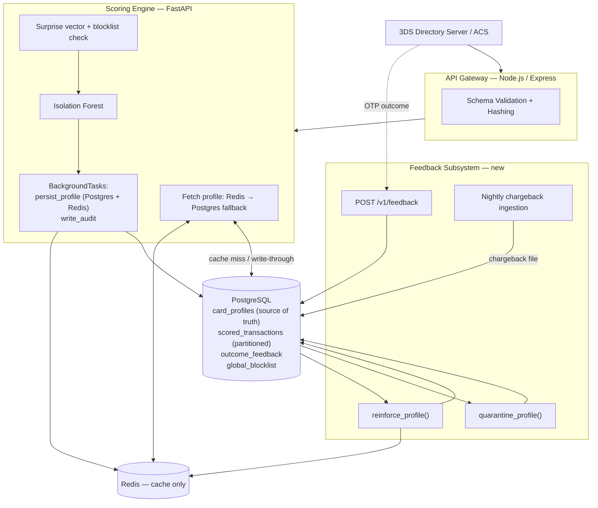

# 3DS Anomaly Detection System — Architecture Addendum
## v4.0 — Response to CTO Review
### Persistent Profile Store · Bounded Growth Controls · Ground-Truth Feedback Loop

---

## 0. How This Document Relates to v3.0

This addendum does **not** replace the v3.0 MVP design — the 50-field mapping, the
surprise-score formulas (§5), the 40-dimensional vector (§6), and the Isolation Forest
training pipeline (§8–9) are unchanged. This document extends three specific areas the
CTO flagged as underspecified:

| v3.0 Gap | Addressed In |
|---|---|
| Redis was the **only** copy of profile state — no durable source of truth | §1 |
| No explicit bound on how top-K/known-value sets grow as a card accumulates history | §2 |
| `outcome_feedback` table existed in the schema but nothing wrote to it or read from it | §3 |

Everything below is additive: new tables, one new endpoint, two new background
processes, and a modification to how the profile store is layered.

---

## 1. Database & Caching Strategy

### 1.1 RDBMS vs. MongoDB — Recommendation: PostgreSQL

**Use PostgreSQL. Do not introduce MongoDB.** Justification:

| Consideration | Why it favors Postgres here |
|---|---|
| **Schema shape** | The profile is not schemaless data — it's a fixed set of ~50 sufficient statistics (EWMA scalars, bounded frequency dicts, hash sets) that every card has, regardless of how many transactions it's seen. Mongo's flexible-schema advantage is designed for documents whose *shape* varies record-to-record. Ours doesn't — it's a JSON *value* with a completely uniform structure, which is exactly what Postgres `JSONB` was built to store. |
| **Concurrency correctness** | §1.3 below requires an atomic read-modify-write with conflict detection (two transactions for the same card arriving within milliseconds). Postgres gives this natively via row-level locking (`SELECT ... FOR UPDATE`) or an optimistic version column inside a real transaction. Mongo's per-document atomicity works too, but you lose the ability to do this *and* join against the audit/feedback tables in one engine. |
| **Operational surface** | The audit log (`scored_transactions`, `outcome_feedback`) already lives in Postgres. Adding Mongo means two database engines to operate, back up, monitor, and secure for an MVP-to-early-production system. One engine that does both jobs is less to get wrong. |
| **Relational integrity** | The feedback loop (§3) needs `outcome_feedback.txn_id → scored_transactions.txn_id → card_profiles.card_id_hash` to be enforceable and joinable for audits ("show me every profile that was reinforced because of transaction X"). Foreign keys and joins are Postgres's strength; they're awkward across Mongo collections without application-level enforcement. |
| **Query needs** | JSONB with a GIN index gives us "find all profiles where `device.platform_freq` contains iOS" if that's ever needed for analytics or a fraud-ring investigation, without giving up the relational structure elsewhere. |
| **When Mongo *would* win** | If profiles had a genuinely variable schema per card, or if we needed to shard writes across dozens of nodes beyond what a single well-tuned Postgres instance handles. At MVP/early-production scale (low hundreds of thousands to a few million cards), a properly indexed Postgres instance — or Postgres with read replicas — comfortably clears this bar. |

**Net effect on the v3.0 diagram:** Redis stops being the system of record and becomes
purely a cache in front of a new `card_profiles` table in Postgres.

### 1.2 New Table: `card_profiles` (persistent source of truth)

```sql
CREATE TABLE card_profiles (
    card_id_hash     TEXT PRIMARY KEY,
    profile          JSONB NOT NULL,
    version          INTEGER NOT NULL DEFAULT 1,      -- optimistic concurrency
    profile_confidence FLOAT NOT NULL DEFAULT 0.0,
    transaction_count  INTEGER NOT NULL DEFAULT 0,
    trust_state        TEXT NOT NULL DEFAULT 'normal'  -- 'normal' | 'elevated_scrutiny'
        CHECK (trust_state IN ('normal','elevated_scrutiny')),
    created_at       TIMESTAMPTZ DEFAULT NOW(),
    updated_at       TIMESTAMPTZ DEFAULT NOW()
);

CREATE INDEX idx_profile_updated ON card_profiles(updated_at);
CREATE INDEX idx_profile_gin     ON card_profiles USING GIN (profile jsonb_path_ops);
```

Why this doesn't reintroduce "50 fields growing forever": `profile` is **upserted**, not
appended — one row per card, same as the Redis value it mirrors. Its size stays ~3 KB
regardless of transaction count, for the same sufficient-statistics reason argued in
v3.0 §4. Postgres just makes that row durable across a Redis restart, eviction, or crash.

### 1.3 Cache Layering — Redis in Front of Postgres

**Read path (cache-aside):**

```
1. GET profile:{card_id_hash} from Redis
2. HIT  → use it (this is the sub-50ms path, unchanged from v3.0 §10 latency budget)
3. MISS → SELECT profile, version FROM card_profiles WHERE card_id_hash = $1
          → if found: populate Redis (SET with TTL), use it
          → if not found: true cold start, new_cold_profile()
```

A cache miss costs one extra Postgres round-trip (typically 3–8 ms on an indexed
primary-key lookup), which still fits inside the p99 50 ms budget — it just eats more
of it. This only happens on a Redis eviction/restart or a card's first-ever
transaction, not on every request.

**Write path (write-through with optimistic concurrency):** this happens inside the
existing `BackgroundTasks` hook, *after* the response is already sent — it does not
sit on the scoring critical path.

```python
async def persist_profile(pg_pool, redis, card_id_hash: str, updated_profile: dict,
                           expected_version: int, max_retries: int = 3) -> None:
    for attempt in range(max_retries):
        async with pg_pool.acquire() as conn:
            result = await conn.execute(
                """UPDATE card_profiles
                   SET profile = $1, version = version + 1,
                       transaction_count = transaction_count + 1,
                       profile_confidence = $2, updated_at = NOW()
                   WHERE card_id_hash = $3 AND version = $4""",
                json.dumps(updated_profile), updated_profile["_meta"]["profile_confidence"],
                card_id_hash, expected_version,
            )
        if result == "UPDATE 1":
            await redis.set(f"profile:{card_id_hash}", json.dumps(updated_profile), ex=86400)
            return
        # version mismatch → another concurrent transaction won the race.
        # Re-read latest, re-apply this transaction's deltas on top, retry.
        current = await conn.fetchrow(
            "SELECT profile, version FROM card_profiles WHERE card_id_hash = $1", card_id_hash)
        updated_profile, expected_version = reapply_update(current["profile"], current["version"], ...)
    raise ProfileConflictError(card_id_hash)  # logged; falls back to next-request retry
```

**Why this matters that v3.0 didn't have:** if a card makes two transactions within the
same few milliseconds (retry storms, rapid re-authentication attempts, or a merchant's
own integration bug), two FastAPI workers can fetch the *same* profile snapshot and
race to write it back — the loser's update silently vanishes. The `version` column
turns that into a detectable conflict instead of a silent lost update.

### 1.4 Meeting the Sub-50ms Requirement — Full Caching Strategy

| Layer | Mechanism | Contribution |
|---|---|---|
| **Redis co-location** | Redis and FastAPI workers in the same private subnet/AZ — no public-internet hop | Keeps `GET` at sub-millisecond network latency |
| **Connection pooling** | `redis.asyncio` pool opened once per worker at startup (unchanged from v3.0) | Avoids per-request connection setup cost |
| **Optional per-worker L1 cache** | A small in-process LRU (e.g. `cachetools.TTLCache`, TTL ≈ 2s) in front of the Redis call, for cards that transact in rapid bursts | Shaves the Redis network round-trip entirely on repeat hits within the TTL window; the 2s staleness window is acceptable since the profile only changes meaningfully after many transactions |
| **Redis Cluster (scale-out path)** | Shard by `card_id_hash` prefix — the v3.0 key design was already cluster-compatible; this is the point where that pays off | Needed once single-node Redis throughput or memory becomes the bottleneck, not at MVP scale |
| **Postgres kept off the hot path** | Only touched on cache miss or in the post-response background task | Guarantees Postgres latency (and any lock contention from §1.3) never affects the response the Directory Server is waiting on |
| **Redis persistence (RDB+AOF)** | Enabled as a second safety net even though Postgres is now the source of truth | Reduces how often a Redis restart forces a wave of Postgres-backed cache misses |

The v3.0 §10 latency table is unchanged for the warm path; add one row for the cold path:

| Stage | Target |
|---|---|
| Profile fetch (Redis hit) | ≤ 2 ms *(unchanged)* |
| Profile fetch (Redis miss → Postgres) | ≤ 10 ms *(new; rare path)* |

---

## 2. Maintaining a Huge, Dynamic Dataset Without Unbounded Growth

### 2.1 The Core Mechanism Was Already Right — Now Made Explicit

v3.0 §4 already avoids storing raw transaction history: every profile field is a
**sufficient statistic** (EWMA, decayed frequency dict, bounded top-K set) that updates
in place. A card with 10,000 transactions has the exact same profile size as a card
with 10 — the number never appears in the storage footprint. This addendum makes the
one missing piece of that story explicit: **what happens when a bounded set is full and
a genuinely new value shows up.**

### 2.2 Eviction Policy for Bounded Sets (new — not specified in v3.0)

Fields like `known_merchant_ids` (K=15), `mcc_freq` (K=10), `known_ip_subnets`,
`device_fp_hashes`, etc. cap their size. When a card has thousands of transactions and
a genuinely new value needs to enter a full set:

```python
def add_to_bounded_set(bounded_dict: dict, key: str, k: int, now_ts: int) -> None:
    """
    bounded_dict: {value: {"freq": float, "last_seen": ts}}
    Adds `key`. If already at capacity k, evicts the lowest-(freq × recency-decay)
    entry rather than the oldest — a merchant seen twice a week ago should survive
    over one seen once six months ago even if the latter has a later raw timestamp
    before decay is applied.
    """
    if key in bounded_dict:
        bounded_dict[key]["freq"] += 1
        bounded_dict[key]["last_seen"] = now_ts
        return
    if len(bounded_dict) >= k:
        weakest = min(bounded_dict.items(),
                      key=lambda kv: kv[1]["freq"] * decay_since(kv[1]["last_seen"], now_ts))
        del bounded_dict[weakest[0]]
    bounded_dict[key] = {"freq": 1.0, "last_seen": now_ts}
```

This is what actually answers "user makes thousands of transactions — how do we avoid
infinite growth": the *profile* never grows past its fixed field count because every
collection has a hard cap with an explicit eviction rule; the *history* is never stored
at all, only its statistical residue.

### 2.3 What Legitimately Does Grow — and How to Bound It

The **audit log** (`scored_transactions`, one row per transaction) grows without bound
by design — that's a compliance/explainability requirement, not a bug. This needs its
own containment strategy, which v3.0 didn't specify:

- **Time-based partitioning**: native Postgres declarative partitioning on
  `scored_transactions` and `outcome_feedback`, partitioned monthly. Queries scoped to
  a recent window (dashboards, feedback lookups) only touch the relevant partition.
- **Automated partition management**: `pg_partman` (or a scheduled job) creates next
  month's partition in advance and drops/detaches partitions past the retention window.
- **Retention + archival**: keep a rolling window of full-fidelity rows in the hot
  database (e.g. 13 months, covering chargeback dispute windows); on expiry, export the
  partition to columnar cold storage (S3/Parquet) for compliance retention, then detach
  it from the live table.
- **Indexes stay small**: because indexes are scoped per-partition, `idx_card_id` and
  `idx_scored_at` (v3.0 §3.4) don't degrade as total history grows — only the active
  partitions are ever scanned in the common case.

### 2.4 Concurrency at Volume

The optimistic-version write path in §1.3 is also the answer to "thousands of
transactions on one card": at genuinely high per-card transaction rates, conflicts on
the `version` column become more likely, not less. The retry loop already handles that;
if conflict rates ever climb high enough to matter, the fallback is a short-lived
per-card Redis lock (`SET lock:{card_id_hash} NX PX 200`) wrapped around the
fetch-modify-write cycle, serializing updates for one card without blocking other
cards or the scoring path itself.

---

## 3. The Feedback Loop — Learning the "New Normal"

This is the one area with no working implementation in v3.0 — the `outcome_feedback`
table existed in the schema (§3.4) but nothing populated or consumed it. This section
builds that end to end.

### 3.1 Two Feedback Channels, Different Urgency

| Channel | Example | Arrives | Ingestion |
|---|---|---|---|
| **Real-time** | OTP challenge succeeds within the same 3DS session | Seconds to minutes after scoring | New `POST /v1/feedback` endpoint, called by the issuer/ACS or the Directory Server integration once the challenge outcome is known |
| **Batch** | Card-network chargeback file | Days to weeks after scoring | Scheduled nightly job (`ingest_chargeback_file.py`) that bulk-inserts outcomes and enqueues the same downstream processing |

Both channels write to the same table and trigger the same two background processes
below — only the entry point and latency differ.

### 3.2 New Endpoint: `POST /v1/feedback`

```python
# Gateway: unauthenticated-from-cardholder, authenticated-from-issuer/ACS integration
app.post("/v1/feedback", apiKeyAuth, async (req, res) => {
  # { txn_id, outcome: "confirmed_legit" | "confirmed_fraud" | "chargeback",
  #   source: "otp_success" | "analyst_review" | "chargeback_file" }
  const result = await httpProxy.post("http://fastapi:8000/internal/feedback", req.body);
  res.json(result.data);
});
```

```python
@app.post("/internal/feedback")
async def feedback(payload: FeedbackPayload, background_tasks: BackgroundTasks):
    txn = await pg_pool.fetchrow(
        "SELECT card_id_hash, deviation_tier, full_report FROM scored_transactions WHERE txn_id = $1",
        payload.txn_id)
    if txn is None:
        raise HTTPException(404, "unknown txn_id")

    await pg_pool.execute(
        "INSERT INTO outcome_feedback (txn_id, outcome, source) VALUES ($1, $2, $3)",
        payload.txn_id, payload.outcome, payload.source)
    await pg_pool.execute(
        "UPDATE scored_transactions SET outcome_label = $1 WHERE txn_id = $2",
        payload.outcome, payload.txn_id)

    if payload.outcome == "confirmed_legit" and txn["deviation_tier"] in ("MEDIUM", "HIGH"):
        background_tasks.add_task(reinforce_profile, txn["card_id_hash"], txn["full_report"])
    elif payload.outcome in ("confirmed_fraud", "chargeback"):
        background_tasks.add_task(quarantine_profile, txn["card_id_hash"], txn["full_report"])

    return {"status": "accepted"}
```

Note this reuses `full_report.contributing_factors` (already stored per-transaction in
v3.0 §12) as the replay source — it already contains each deviating field's *observed*
value, which is exactly what's needed to promote it to "known" without re-deriving
anything from the original request payload.

### 3.3 Background Process: `reinforce_profile` (new)

This is the direct answer to the CTO's worked example: transaction flagged HIGH because
of a new device, bank authorizes after OTP success → next transaction on that device
should not be flagged again for the same reason.

```python
async def reinforce_profile(card_id_hash: str, full_report: dict) -> None:
    profile, version = await load_profile_for_update(card_id_hash)   # cache-aside, §1.3

    for factor in full_report["contributing_factors"]:
        field, observed = factor["field"], factor["observed"]

        if field in PROBATION_FIELDS:
            # Skip the slow trust_threshold accumulation (v3.0 §4) — a confirmed-legit
            # outcome is stronger evidence than N more ordinary transactions would be.
            probation_key = f"{field}.{observed}"
            profile["device"]["probation"].pop(probation_key, None)
            promote_to_known_set(profile, field, observed, initial_weight=0.3)

        elif field in KNOWN_UNKNOWN_FIELDS and observed not in get_known_set(profile, field):
            add_to_bounded_set(get_known_set(profile, field), observed,
                                k=BOUNDED_SET_SIZE[field], now_ts=now())

        # EWMA/numeric fields (amount, geo) are intentionally left to ordinary decay —
        # a single confirmed transaction shouldn't overweight a continuous statistic
        # the way it should for a binary known/unknown identity fact.

    profile["_meta"]["last_reinforced"] = now()
    await persist_profile(pg_pool, redis, card_id_hash, profile, version)
    await pg_pool.execute(
        "INSERT INTO profile_reinforcement_log (card_id_hash, reinforced_at, reason) "
        "VALUES ($1, NOW(), $2)", card_id_hash, "otp_confirmed_legit")
```

### 3.4 Background Process: `quarantine_profile` (new)

Fraud confirmation is asymmetric with reinforcement: you cannot cleanly "un-EWMA" a
value that's already blended into a rolling statistic, and by the time a chargeback
lands the profile has usually moved on several more transactions. So instead of trying
to reverse history, this process (a) prevents the same bad signal from being trusted
elsewhere, and (b) makes the *card* more cautious going forward:

```python
async def quarantine_profile(card_id_hash: str, full_report: dict) -> None:
    profile, version = await load_profile_for_update(card_id_hash)

    # 1. Global blocklist — the same device/IP/address showing up on a different
    #    card is now a much stronger signal than a first-time novelty score.
    for factor in full_report["contributing_factors"]:
        if factor["field"] in GLOBAL_BLOCKLIST_ELIGIBLE_FIELDS:
            await pg_pool.execute(
                "INSERT INTO global_blocklist (field, value_hash, flagged_at, source_card) "
                "VALUES ($1, $2, NOW(), $3) ON CONFLICT DO NOTHING",
                factor["field"], factor["observed"], card_id_hash)

    # 2. Card-level elevated scrutiny — force stronger cohort-shrinkage (v3.0 §7)
    #    on this card's next transactions regardless of its accumulated confidence.
    profile["_meta"]["profile_confidence"] = min(profile["_meta"]["profile_confidence"], 0.3)
    await pg_pool.execute(
        "UPDATE card_profiles SET trust_state = 'elevated_scrutiny' WHERE card_id_hash = $1",
        card_id_hash)

    await persist_profile(pg_pool, redis, card_id_hash, profile, version)
```

**New table backing this:**

```sql
CREATE TABLE global_blocklist (
    id           BIGSERIAL PRIMARY KEY,
    field        TEXT NOT NULL,          -- e.g. 'device.application_package_name'
    value_hash   TEXT NOT NULL,          -- same hash representation already used in profiles
    flagged_at   TIMESTAMPTZ DEFAULT NOW(),
    source_card  TEXT NOT NULL,          -- card_id_hash that surfaced this
    UNIQUE (field, value_hash)
);

CREATE TABLE profile_reinforcement_log (
    id            BIGSERIAL PRIMARY KEY,
    card_id_hash  TEXT NOT NULL,
    reinforced_at TIMESTAMPTZ DEFAULT NOW(),
    reason        TEXT
);
```

At scoring time, the surprise-vector computation (v3.0 §5) gains one more cross-field
check: a lookup against `global_blocklist` for the current transaction's device/IP/
address hashes, scored the same way an unknown value would be but with a fixed high
weight rather than derived from this card's own stability — this card has never seen
it, but the fleet has, and for a bad reason.

### 3.5 Elevated-Scrutiny Decay

`trust_state = 'elevated_scrutiny'` isn't permanent — it should relax after a defined
window of clean transactions (e.g. 30 days with no further fraud confirmation), handled
by the existing decay pass in `update_profile` checking `updated_at` against a
threshold and resetting `trust_state` to `'normal'`. This prevents one confirmed fraud
event from permanently penalizing a card that's since been re-issued or recovered.

---

## 4. Updated Architecture Diagram



---

## 5. Updated Step-by-Step Workflow for a Single Transaction

```mermaid
sequenceDiagram
    participant DS as Directory Server / ACS
    participant GW as Gateway
    participant FA as FastAPI Worker
    participant RD as Redis
    participant PG as PostgreSQL

    DS->>GW: POST /v1/score (AReq, 50 fields)
    GW->>FA: POST /internal/score (hashed)

    FA->>RD: GET profile:{card_id_hash}
    alt cache hit
        RD-->>FA: profile JSON
    else cache miss
        FA->>PG: SELECT profile, version FROM card_profiles
        PG-->>FA: profile JSON + version (or not found → cold start)
        FA->>RD: SET profile (repopulate cache)
    end

    FA->>PG: blocklist lookup (device/IP/address hashes)
    FA->>FA: compute surprise vector, IF score, tier
    FA-->>GW: DeviationReport
    GW-->>DS: DeviationReport
    Note over GW,DS: Response sent — background work below does not block it

    par Background: profile persistence
        FA->>FA: update_profile (decay, EWMA, bounded-set eviction §2.2)
        FA->>PG: UPDATE card_profiles ... WHERE version = expected (optimistic lock)
        FA->>RD: SET profile (refresh cache)
    and Background: audit
        FA->>PG: INSERT INTO scored_transactions (full_report incl. contributing_factors)
    end

    Note over DS,PG: --- minutes to weeks later: ground truth arrives ---

    DS->>GW: POST /v1/feedback {txn_id, outcome: confirmed_legit, source: otp_success}
    GW->>FA: POST /internal/feedback
    FA->>PG: INSERT INTO outcome_feedback; UPDATE scored_transactions.outcome_label

    alt confirmed_legit on a MEDIUM/HIGH transaction
        FA->>FA: reinforce_profile() — promote probation/unknown fields to known
        FA->>PG: UPDATE card_profiles (fast-tracked trust)
        FA->>RD: SET profile (refresh cache)
    else confirmed_fraud / chargeback
        FA->>FA: quarantine_profile()
        FA->>PG: INSERT global_blocklist; UPDATE card_profiles.trust_state='elevated_scrutiny'
    end
```

---

## 6. Components to Add or Change — Summary

| Component | Status | Change |
|---|---|---|
| `card_profiles` table (Postgres) | **New** | Durable source of truth for profile JSONB; optimistic-concurrency `version` column |
| Redis profile store | **Changed** | Demoted from source of truth to cache-aside layer in front of Postgres |
| Profile read path | **Changed** | Cache-aside: Redis → Postgres fallback → cold start |
| Profile write path | **Changed** | Write-through with optimistic-concurrency retry, still fired from `BackgroundTasks` post-response |
| Bounded-set eviction (`add_to_bounded_set`) | **New** | Explicit lowest-decayed-frequency eviction so top-K/known-value fields never grow past `k` regardless of transaction volume |
| `scored_transactions` / `outcome_feedback` partitioning | **New** | Monthly range partitions + retention/archival job |
| `POST /v1/feedback` endpoint | **New** | Ground-truth ingestion (OTP outcome, analyst review, chargeback) |
| `ingest_chargeback_file.py` | **New** | Nightly batch job for delayed chargeback feedback |
| `reinforce_profile()` background process | **New** | Fast-tracks probation/unknown-value fields to "known" on confirmed-legit outcomes |
| `quarantine_profile()` background process | **New** | Global blocklist insertion + card-level elevated scrutiny on confirmed-fraud outcomes |
| `global_blocklist` table (Postgres) | **New** | Cross-card sharing of confirmed-bad device/IP/address signals |
| `profile_reinforcement_log` table (Postgres) | **New** | Audit trail explaining why a profile's trust was fast-tracked |
| Surprise-vector computation (v3.0 §5/§6) | **Changed** | One new cross-field check: blocklist lookup, fixed high weight, independent of this card's own stability score |
| `trust_state` field on `card_profiles` | **New** | `elevated_scrutiny` after confirmed fraud, decaying back to `normal` after a clean window |

---

## 7. Trade-offs Carried Forward

These new components inherit the same MVP-appropriate philosophy as v3.0 §14 — real
locking instead of Kafka, retry loops instead of a dedicated job queue, a single
Postgres instance instead of a cluster. The main new debt introduced here: **fast-path
feedback (OTP outcome) depends on the issuer/ACS actually calling `/v1/feedback`** —
if that integration doesn't exist yet on the ACS side, the reinforcement path only
fires from analyst review and chargeback files, which is strictly slower to reach
"new normal" but not incorrect.
