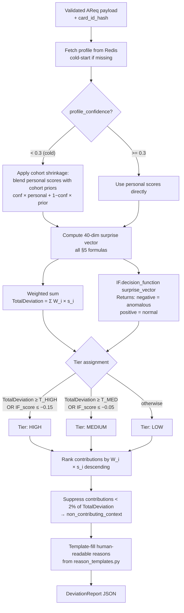
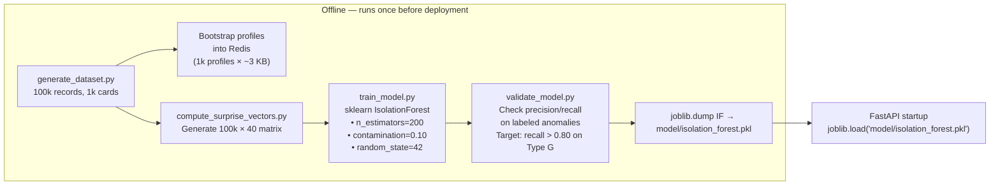

# 3DS Anomaly Detection System — MVP Design
## Lean Microservices Edition
### SDK Channel · 50 Vital Fields · Pre-Trained Isolation Forest

---

## 0. System Scope & Technology Decisions

This system evaluates incoming EMV 3DS authentication requests against a card's established
behavioral profile and returns a field-level deviation report. It covers the **SDK channel
exclusively**, scoring **50 vital fields** across the five 3DS parameter sub-categories.

| Design Area | Decision | Rationale |
|---|---|---|
| Async profile updates | **FastAPI `BackgroundTasks`** | Profile updates fire after the response is returned, keeping the request path read-only and fast |
| Profile bootstrapping | **Offline Python script on 100k synthetic records** | No cluster infrastructure required at this data volume |
| Stream enrichment | **Stateless FastAPI worker** | Per-request stateless scoring; all card state lives in Redis |
| Feature parity (train vs. serve) | **Shared `features.py` module** used by both training and serving | Single source of truth for all feature computation logic |
| Model serving | **`model/isolation_forest.pkl` loaded on startup** | Model is in RAM for every worker from the moment the process starts; no per-request loading |
| IP geolocation | **Accept raw `Latitude`/`Longitude` from device payload** | GPS coordinates are provided directly in the SDK payload |
| Address geo-matching | **Hash text fields for known/unknown; GPS for distance** | No geocoding API call needed on the request path |
| Amount distribution | **EWMA mean + standard deviation** | Sufficient statistical signal for the scoring approach used |
| Profile serialisation | **JSON stored in Redis** | Straightforward to inspect and debug during development |
| Channel scope | **SDK channel only** | The SDK channel provides stronger and more tamper-evident device identity signals than browser |

**Statistical and ML core:**
- Additive per-field surprise scoring formula (Laplace-smoothed self-information, Z-scores, histogram density)
- `acctInfo` regression detector and velocity checks
- Isolation Forest as a secondary ensemble over the 40-dimensional surprise vector
- Probation mechanism for new values entering a card's profile
- Cross-field consistency checks (clock skew, platform–OS coherence, geo triangulation)
- Deviation report output contract with field-level contribution percentages and templated reasons
- Exponential decay-based profile adaptation

---

## 1. The Vital 50 Fields (SDK Channel)

One input field from the 3DS spec may produce one or more surprise score dimensions
(e.g., four billing address fields fold into a single composite hash check). The
50 fields below collapse into a **40-dimensional surprise vector** that feeds the
Isolation Forest (see §6).

### Transaction Details (8 fields)

| # | Field | Profile Representation | Scoring Method |
|---|---|---|---|
| 1 | `acctNumber` | SHA-256 → Redis key | **Key only; never scored** |
| 2 | `acctType` | Decayed frequency dict `{Credit: 0.9, Debit: 0.1}` | Laplace-smoothed self-information |
| 3 | `mcc` | Top-K (K=10) decayed frequency | Laplace self-information |
| 4 | `merchantCountryCode` | Top-K (K=5) decayed frequency | Laplace self-information |
| 5 | `purchaseAmount` | EWMA of `log(1 + amount)`; EWMA of squared deviation | Z-score on log-transformed amount |
| 6 | `purchaseCurrency` | Top-K (K=3) decayed frequency | Laplace self-information |
| 7 | `purchaseDate` | Hour-of-day histogram (24 bins) + day-of-week histogram (7 bins), decayed | Histogram density surprise `−log₂(density + ε)` |
| 8 | `cardSecurityCodeStatus` | EWMA match rate (Match / No Match / Unavailable) | Deviation from historical EWMA |

### 3DS Requestor Details (13 fields)

| # | Field | Profile Representation | Scoring Method |
|---|---|---|---|
| 9 | `threeDSRequestorID` | Bounded set (K=10) with `{freq, last_seen_ts}` | Known / Unknown (novelty score `f(stability)`) |
| 10 | `threeDSRequestorURL` | Hashed eTLD+1 domain; bounded set (K=10) | Known / Unknown |
| 11 | `threeDSRequestorAuthenticationInd` | Decayed frequency dist | Laplace self-information |
| 12 | `threeDSReqAuthMethod` | Top-K (K=5) decayed frequency | Laplace self-information |
| 13 | `chAccAgeInd` | Last-seen ordinal integer (1–5) | **Regression detector**: any decrease = penalty × steps |
| 14 | `chAccChangeInd` | EWMA of ordinal value | EWMA deviation (sudden "recent change" spike) |
| 15 | `chAccPwChangeInd` | EWMA of ordinal value | EWMA deviation |
| 16 | `txnActivityDay` | EWMA mean + EWMA variance (Welford) | Z-score; values > 3σ = velocity spike |
| 17 | `txnActivityYear` | EWMA mean + EWMA variance | Z-score; cross-validated vs. `txnActivityDay` |
| 18 | `provisionAttemptsDay` | EWMA mean (≈ 0 for most legitimate cards) | Spike: any non-zero when historical mean < 0.1 → HIGH weight |
| 19 | `nbPurchaseAccount` | EWMA mean + EWMA variance | Z-score |
| 20 | `suspiciousAccActivity` | Sticky boolean flag | **Direct HIGH weight** — merchant is signalling past suspicious activity |
| 21 | `shipNameIndicator` | EWMA match rate (bool → float) | Deviation from EWMA |

### Merchant Details (11 fields, folded into fewer scores)

| # | Field | Profile Representation | Scoring Method |
|---|---|---|---|
| 22 | `acquirerMerchantID` | Bounded set (K=15) with recency | Known / Unknown |
| 23 | `acquirerBIN` | Bounded set (K=10) | Known / Unknown |
| 24 | `shipIndicator` | Top-K (K=5) decayed frequency | Laplace self-information |
| 25 | `billAddrLine1` | ↘ | ↘ |
| 26 | `billAddrCity` | ↘ | ↘ |
| 27 | `billAddrCountry` | SHA-256 of normalise(L1 + City + Country + PostCode); bounded set (K=3) | Known / Unknown — "did billing address text change?" |
| 28 | `billAddrPostCode` | ↗ | ↗ |
| 29 | `email` | SHA-256 of `lowercase(email)`; bounded set (K=2) | Known / Unknown |
| 30 | `mobilePhone` | SHA-256; bounded set (K=2) | Known / Unknown |
| 31 | `shipAddrCity` | ↘ | ↘ |
| 32 | `shipAddrCountry` | SHA-256 of normalise(City + Country); bounded set (K=5) | Known / Unknown — wider set (shipping legitimately varies) |

### Device Details (18 fields, SDK channel)

| # | Field | Profile Representation | Scoring Method |
|---|---|---|---|
| 33 | `sdkInterface` | Bounded set (K=2: Native / HTML) | Known / Unknown |
| 34 | `sdkUiType` | Bounded set (K=3) | Known / Unknown |
| 35 | `Platform` | Decayed frequency (`iOS`, `Android`) | Laplace self-information — **highest individual weight** |
| 36 | `Device Model` | Top-K (K=5) decayed frequency | Laplace self-information |
| 37 | `OS Name` | Top-K (K=3) decayed frequency | Laplace self-information + coherence with Platform |
| 38 | `OS Version` | Top-K (K=3) decayed frequency | Known/Unknown + **asymmetric**: downgrade penalised more than upgrade |
| 39 | `Locale` | Top-K (K=3) decayed frequency | Laplace self-information |
| 40 | `Time Zone` | Bounded set (K=3) IANA strings | Known / Unknown |
| 41 | `Screen Resolution` | Bounded set (K=5) | Known / Unknown |
| 42 | `IP Address` | Hashed /24 subnet; bounded set (K=5) | Known / Unknown at subnet level |
| 43 | `Latitude` | Part of device geo centroid | ↘ Haversine to centroid, normalised by `typical_radius_km` |
| 44 | `Longitude` | Part of device geo centroid | ↗ |
| 45 | `Application Package Name` | SHA-256; bounded set (K=2) | Known / Unknown — **VERY HIGH weight** |
| 46 | `SDK App ID` | SHA-256; bounded set (K=3) | Known / Unknown |
| 47 | `SDK Version` | Top-K (K=3) | Known/Unknown + direction check |
| 48 | `SDK Ref Number` | Stored expected SHA-256 | **Tamper flag** if hash changes |
| 49 | `Device Name` | SHA-256; bounded set (K=5) | Known / Unknown (supporting signal) |
| 50 | `dateTime` | — | Cross-field: clock skew vs. `purchaseDate`; flag if \|Δ\| > 300 s |

---

## 2. System Architecture

### 2.1 Service Overview

```
┌───────────────────────────────────────────────────────────────────────┐
│  3DS Directory Server                                                 │
│  AReq JSON payload (50 fields, SDK channel)                          │
└────────────────────────────┬──────────────────────────────────────────┘
                             │ HTTPS
                             ▼
┌────────────────────────────────────────────────────────────────────────┐
│  Node.js / Express  —  API Gateway                                    │
│  • JSON schema validation (Joi / Zod)                                 │
│  • SHA-256(acctNumber) → card_id_hash                                 │
│  • Rate limiting (express-rate-limit)                                 │
│  • API key auth                                                       │
│  • Proxy to FastAPI scoring cluster (http-proxy-middleware)           │
└────────────────────────────┬──────────────────────────────────────────┘
                             │ Internal HTTP (JSON)
                             ▼
┌────────────────────────────────────────────────────────────────────────┐
│  Python / FastAPI  —  Scoring Engine                          [×N]    │
│  (Uvicorn, N worker processes)                                        │
│                                                                       │
│  On startup (once per worker):                                        │
│  • joblib.load("model/isolation_forest.pkl") → IF model in RAM       │
│  • redis.ConnectionPool → shared across async handlers                │
│  • asyncpg.Pool → PostgreSQL audit log                                │
│                                                                       │
│  Per request (~20–40 ms):                                            │
│  • await redis.get(card_id_hash) → profile JSON (~3 KB)             │
│  • Extract features, compute 40-dim surprise vector                  │
│  • Weighted sum → TotalDeviation                                     │
│  • IF.decision_function(surprise_vector) → ensemble signal           │
│  • Tier assignment + template-fill explanation                        │
│  • Return DeviationReport JSON                                        │
│  • fire background_tasks (profile update + audit log)                │
└────────┬───────────────────────────────────────────┬─────────────────┘
         │ await redis.set (background)              │ await asyncpg.execute (background)
         ▼                                           ▼
┌─────────────────────┐                   ┌────────────────────────────┐
│  Redis Cluster      │                   │  PostgreSQL                │
│  Profile Store      │                   │  Audit Log                 │
│  ~3 KB/card (JSON)  │                   │  scored_transactions table │
│  sub-ms GET/SET     │                   │  + outcome_feedback table  │
└─────────────────────┘                   └────────────────────────────┘
```

### 2.2 Architecture Diagram

```mermaid
flowchart TB
    DS[3DS Directory Server\nAReq payload]

    subgraph GW["API Gateway — Node.js / Express"]
        V[JSON Schema Validation]
        H[SHA-256 acctNumber hash]
        RL[Rate Limiting]
        P[Proxy to FastAPI]
    end

    subgraph SE["Scoring Engine — Python / FastAPI (Uvicorn × N workers)"]
        direction TB
        ST["Startup: load IF.pkl into RAM\nopen Redis + Postgres pools"]
        RF[Fetch profile from Redis]
        FE2[Feature Extraction\n50 fields → preprocessing]
        SC2[Compute 40-dim Surprise Vector\n(all §6 formulas)]
        IF2[Isolation Forest inference\nIF.pkl already in RAM]
        WS[Weighted sum → TotalDeviation]
        EX[Explanation Generator\ntemplate-fill, rank, tier]
        BG["BackgroundTasks (post-response)\n• update_profile → Redis\n• write_audit → Postgres"]
    end

    REDIS[("Redis\nProfile Store\n~3 KB/card")]
    PG[("PostgreSQL\nAudit Log")]

    DS --> GW
    GW --> SE
    SE --> RF --> REDIS
    RF --> FE2 --> SC2
    SC2 --> IF2
    SC2 --> WS
    IF2 --> EX
    WS --> EX
    EX --> RESP[DeviationReport JSON]
    RESP --> BG
    BG --> REDIS
    BG --> PG
```

---

## 3. Service Design

### 3.1 Node.js / Express — API Gateway

**Responsibilities:**
- Absorb the concurrency spikes of load tests without queuing delay. Node's non-blocking event loop handles 10,000+ concurrent connections on a single thread — no threading overhead, no context-switching cost — making it the right tool for an I/O-bound proxy role.
- Validate the AReq JSON shape before it reaches Python (saves FastAPI workers from wasting time on malformed payloads).
- Hash `acctNumber` once here so the raw PAN never reaches the Python layer or appears in any log.

**What it does NOT do:** business logic, feature scoring, or any Redis/Postgres I/O.

```javascript
// Sketch — not production code
const schema = Joi.object({
  acctNumber: Joi.string().required(),
  acctType:   Joi.string().valid('01','02').required(),
  purchaseAmount: Joi.number().positive().required(),
  // ... all 50 field validations
});

app.post('/v1/score', rateLimiter, apiKeyAuth, async (req, res) => {
  const { error } = schema.validate(req.body);
  if (error) return res.status(400).json({ error: error.details });

  const enriched = {
    ...req.body,
    card_id_hash: sha256(req.body.acctNumber),
    acctNumber: undefined,   // PAN never forwarded
  };

  const result = await httpProxy.post('http://fastapi:8000/internal/score', enriched);
  res.json(result.data);
});
```

### 3.2 Python / FastAPI — Scoring Engine

**Multi-worker startup:** Each worker independently loads the IF model, Redis pool, and Postgres pool. Workers share no state — all per-card state lives in Redis.

```
uvicorn main:app --host 0.0.0.0 --port 8000 --workers 4
```

**Why 4 workers:** Python's GIL means one process can only run one thread at a time. With 4 workers, 4 requests can score concurrently. Since scoring is CPU-bound (numpy operations), more workers than CPU cores yields diminishing returns. Tune to `(2 × CPU cores) + 1` per Uvicorn recommendation.

```python
# main.py startup sketch
from fastapi import FastAPI, BackgroundTasks
import joblib, redis.asyncio as aioredis, asyncpg

app = FastAPI()
IF_MODEL = None
redis_pool = None
pg_pool = None

@app.on_event("startup")
async def startup():
    global IF_MODEL, redis_pool, pg_pool
    IF_MODEL = joblib.load("model/isolation_forest.pkl")
    redis_pool = aioredis.ConnectionPool.from_url("redis://redis:6379")
    pg_pool = await asyncpg.create_pool(dsn=PG_DSN)

@app.post("/internal/score")
async def score(payload: AReqPayload, background_tasks: BackgroundTasks):
    r = aioredis.Redis(connection_pool=redis_pool)
    raw = await r.get(f"profile:{payload.card_id_hash}")
    profile = json.loads(raw) if raw else new_cold_profile(payload.card_id_hash)

    surprise_vector, contributions = extract_and_score(payload, profile, STATIC_WEIGHTS)
    if_score = IF_MODEL.decision_function([surprise_vector])[0]
    report = build_report(payload, contributions, if_score, profile)

    background_tasks.add_task(update_profile, r, payload.card_id_hash, payload, profile)
    background_tasks.add_task(write_audit,   pg_pool, report)
    return report
```

**BackgroundTask risk acknowledgement:** If the Uvicorn worker process is killed between returning the response and completing the background tasks, the profile update and audit log write are lost. This is a known trade-off of this approach — the request path remains fast and read-only, but updates are not guaranteed on hard crashes.

### 3.3 Redis Profile Store

**Key format:** `profile:{card_id_hash}` (card_id_hash = SHA-256 of acctNumber, 64 hex chars)

**Value format:** JSON string (see §4 for schema). Serialisation with `orjson` is recommended over stdlib `json` for ~3–5× faster encode/decode on 3 KB payloads.

**TTL policy:** `EXPIRE profile:{card_id_hash} 7776000` (90 days). A card not seen in 90 days returns to cold-start on next transaction; its profile is reconstructed from the next few authentications with increased cold-start shrinkage. This prevents unbounded Redis growth.

**Sizing at MVP scale:** Assume 100k active cards × 3 KB/profile = 300 MB. A single Redis node with 1 GB RAM has comfortable headroom. Redis Cluster is not required for MVP but the key design (`profile:` prefix, hash-based routing) is cluster-compatible.

### 3.4 PostgreSQL — Audit Log

```sql
CREATE TABLE scored_transactions (
    id                  BIGSERIAL PRIMARY KEY,
    txn_id              TEXT NOT NULL UNIQUE,
    card_id_hash        TEXT NOT NULL,
    scored_at           TIMESTAMPTZ DEFAULT NOW(),
    deviation_tier      TEXT CHECK (deviation_tier IN ('LOW','MEDIUM','HIGH')),
    total_deviation     FLOAT,
    if_score            FLOAT,
    profile_confidence  FLOAT,
    channel             TEXT DEFAULT 'SDK',
    contributing_factors JSONB,
    full_report         JSONB,
    outcome_label       TEXT DEFAULT NULL   -- populated by feedback API
);

CREATE TABLE outcome_feedback (
    id              BIGSERIAL PRIMARY KEY,
    txn_id          TEXT REFERENCES scored_transactions(txn_id),
    feedback_at     TIMESTAMPTZ DEFAULT NOW(),
    outcome         TEXT CHECK (outcome IN ('confirmed_legit','confirmed_fraud','chargeback')),
    source          TEXT  -- 'chargeback_file', 'analyst_review', 'otp_success'
);

CREATE INDEX idx_card_id   ON scored_transactions(card_id_hash);
CREATE INDEX idx_scored_at ON scored_transactions(scored_at);
CREATE INDEX idx_tier      ON scored_transactions(deviation_tier);
```

---

## 4. Profile Schema (JSON in Redis)

Every value is a **sufficient statistic** — the minimum information needed to compute
surprise without storing raw transaction history. Profile size is bounded at ~3 KB
regardless of how many transactions the card has accumulated.

```json
{
  "_meta": {
    "card_id_hash": "a3f8...",
    "created_at": 1719475200,
    "last_updated": 1719561600,
    "history_depth_days": 22,
    "transaction_count": 14,
    "profile_confidence": 0.41
  },

  "transaction": {
    "acct_type_freq":    {"01": 0.95, "02": 0.05},
    "mcc_freq":          {"5411": 0.6, "5812": 0.25, "5944": 0.15},
    "country_freq":      {"356": 0.98, "840": 0.02},
    "currency_freq":     {"356": 0.99},
    "amount_ewma_log":   7.32,
    "amount_ewma_var":   0.28,
    "hour_hist":         [0.0, 0.0, 0.0, 0.0, 0.0, 0.0, 0.0, 0.01, 0.05, 0.12, 0.15, 0.12, 0.1, 0.08, 0.09, 0.11, 0.1, 0.07, 0.04, 0.03, 0.02, 0.01, 0.0, 0.0],
    "dow_hist":          [0.12, 0.18, 0.17, 0.16, 0.15, 0.12, 0.1],
    "cvv_match_rate":    0.98
  },

  "requestor": {
    "known_requestors": {
      "REQA001": {"freq": 0.9,  "last_seen": 1719475200},
      "REQB002": {"freq": 0.1,  "last_seen": 1718870400}
    },
    "known_req_urls": ["d3abc.hash", "d4def.hash"],
    "auth_ind_freq":  {"01": 0.85, "02": 0.15},
    "auth_method_freq": {"02": 0.7, "06": 0.3},
    "ch_acc_age_ind_last": 5,
    "ch_acc_change_ind_ewma": 4.2,
    "ch_acc_pw_change_ind_ewma": 4.5,
    "txn_activity_day_ewma": 1.3,
    "txn_activity_day_var":  0.9,
    "txn_activity_year_ewma": 47.0,
    "txn_activity_year_var":  15.0,
    "provision_attempts_ewma": 0.0,
    "provision_attempts_var":  0.0,
    "nb_purchase_ewma":  40.0,
    "nb_purchase_var":   12.0,
    "suspicious_ever":   false,
    "ship_name_match_rate": 0.98
  },

  "merchant": {
    "known_merchant_ids": {
      "MID12345": {"freq": 0.75, "last_seen": 1719475200},
      "MID99876": {"freq": 0.25, "last_seen": 1718870400}
    },
    "known_acquirer_bins": ["411111", "422222"],
    "ship_ind_freq": {"01": 0.8, "03": 0.2},
    "billing_addr_hashes": ["b1hash", "b2hash"],
    "shipping_addr_hashes": ["s1hash", "s2hash", "s3hash", "s4hash", "s5hash"],
    "known_email_hashes":  ["ehash1"],
    "known_phone_hashes":  ["phash1"],
    "billing_lat":  18.52,
    "billing_lon":  73.85,
    "billing_radius_km": 3.2,
    "shipping_lat": 18.54,
    "shipping_lon": 73.87,
    "shipping_radius_km": 18.0
  },

  "device": {
    "platform_freq":     {"Android": 0.99, "iOS": 0.01},
    "device_model_freq": {"SM-G991B": 0.95, "SM-A525F": 0.05},
    "os_name_freq":      {"Android": 1.0},
    "os_version_freq":   {"13": 0.6, "14": 0.4},
    "locale_freq":       {"en_IN": 0.95, "hi_IN": 0.05},
    "known_timezones":   ["Asia/Kolkata"],
    "known_resolutions": ["1080x2340", "1080x2400"],
    "known_ip_subnets":  ["192.168.1.0/24", "103.45.12.0/24"],
    "device_fp_hashes":  ["fp_hash_1", "fp_hash_2"],
    "known_app_packages": ["pkg_hash_a"],
    "known_sdk_app_ids":  ["sdk_id_hash_1"],
    "sdk_version_freq":   {"5.2.1": 0.4, "5.3.0": 0.6},
    "expected_sdk_ref_hash": "ref_hash_constant",
    "known_device_names": ["dn_hash_1"],
    "known_sdk_interfaces": ["02"],
    "geo_lat":   18.52,
    "geo_lon":   73.85,
    "geo_radius_km": 8.5,
    "probation": {}
  }
}
```

**Probation sub-object:**
Newly seen values that have not yet accumulated enough corroborating transactions to be trusted enter probation. The structure tracks them separately from the main frequency distributions:

```json
"probation": {
  "device.platform.iOS": {"count": 1, "first_seen": 1719475200, "trust_threshold": 3},
  "device.app_package.pkg_hash_b": {"count": 0, "first_seen": 1719561600, "trust_threshold": 5}
}
```

A value in probation is **still scored** (it generates a surprise score on the first occurrence), but its decay half-life is extended until it reaches `trust_threshold` confirmations.

---

## 5. Feature Engineering

All formulas below use EWMA-based statistics and Laplace-smoothed distributions. GPS coordinates are accepted directly from the device payload; no IP geolocation or address geocoding is performed on the request path.

### 5.1 Categorical Fields — Laplace-Smoothed Self-Information

Applied to: `acctType`, `mcc`, `merchantCountryCode`, `purchaseCurrency`,
`threeDSRequestorAuthenticationInd`, `threeDSReqAuthMethod`,
`shipIndicator`, `Platform`, `Device Model`, `OS Name`, `Locale`.

```python
def surprise_categorical(observed: str, freq_dict: dict, alpha=0.5) -> float:
    """
    Returns surprise in bits. 0 = perfectly expected. ~3–5 = never seen before.
    alpha: Laplace smoothing constant. Higher = softer penalty for unseen values.
    """
    total = sum(freq_dict.values()) + alpha * max(len(freq_dict), 1)
    p_hat = (freq_dict.get(observed, 0.0) + alpha) / total
    return -math.log2(p_hat)
```

### 5.2 Purchase Amount — Z-Score on Log-Transformed Amount

Applied to: `purchaseAmount` (optionally bucketed by `mcc` — use global profile if
MCC has < 5 historical transactions).

```python
def surprise_amount(amount: float, ewma_log: float, ewma_var: float) -> float:
    """
    Log-transform handles right-skew (most amounts cluster low; occasional large ones).
    Returns absolute z-score — both unusually high and unusually low are flagged.
    """
    log_amount = math.log1p(amount)
    std = math.sqrt(max(ewma_var, 1e-6))   # floor prevents division by zero
    z = abs(log_amount - ewma_log) / std
    return z
```

### 5.3 Temporal Histogram — Density Surprise

Applied to: `purchaseDate` (split into hour-of-day and day-of-week components).

```python
def surprise_temporal(purchase_dt: datetime, hour_hist: list, dow_hist: list) -> float:
    hour = purchase_dt.hour               # 0–23
    dow  = purchase_dt.weekday()          # 0=Monday, 6=Sunday

    h_density = max(hour_hist[hour], 1e-4)    # floor avoids log(0)
    d_density = max(dow_hist[dow],   1e-4)

    s_hour = -math.log2(h_density)
    s_dow  = -math.log2(d_density)
    return (s_hour + s_dow) / 2.0             # average of two temporal signals
```

### 5.4 Geolocation — Haversine to Centroid, Normalised by Radius

Applied to: `Latitude`/`Longitude` vs. device geo centroid; billing address centroid
is the same math with the profile's `billing_lat`/`billing_lon`.

```python
def surprise_geo(obs_lat: float, obs_lon: float,
                 centroid_lat: float, centroid_lon: float,
                 typical_radius_km: float, min_radius_km=2.0) -> float:
    distance_km = haversine(obs_lat, obs_lon, centroid_lat, centroid_lon)
    radius      = max(typical_radius_km, min_radius_km)
    z           = distance_km / radius
    return math.log1p(z)    # log-scaled: z=1→0.69, z=3→1.39, z=10→2.40
```

### 5.5 Known / Unknown Sets — Identity Novelty

Applied to: `threeDSRequestorID`, `threeDSRequestorURL`, `acquirerMerchantID`,
`billing_addr_hash`, `shipping_addr_hash`, `email_hash`, `phone_hash`,
`device_fp_composite`, `Application Package Name`, `SDK App ID`, `SDK Ref Number`,
`IP Address` (/24 subnet), `Device Name`, `Time Zone`, `Screen Resolution`.

```python
def surprise_known_unknown(observed_hash: str, known_set: list,
                           stability: float = None) -> float:
    """
    stability: 1 / (len(known_set) + 1). A card with many known IDs is
    penalised less for a new one than a card with exactly one known ID.
    """
    if observed_hash in known_set:
        return 0.0

    if stability is None:
        stability = 1.0 / max(len(known_set), 1)

    # New value: score scales with how locked-in the card's identity is
    return -math.log2(stability + 1e-9)
```

**Special case — Application Package Name:** If `observed_hash not in known_app_packages`,
return `HIGH_WEIGHT_CONSTANT` (4.0) directly, bypassing the stability formula.
A different application performing 3DS authentication is an integrity concern, not a
gradual drift signal.

**Special case — SDK Ref Number:** If `hash(observed) != expected_sdk_ref_hash`, return
`TAMPER_FLAG_WEIGHT` (5.0) directly and append `"sdk_ref_tamper": true` to the report.

### 5.6 `acctInfo` — Regression and Velocity Checks

```python
def score_acct_info(payload, profile_acctinfo: dict) -> dict:
    scores = {}

    # Regression check — ordered-categorical fields that should only increase
    for field, key in [("chAccAgeInd", "ch_acc_age_ind_last"),
                       ("paymentAccInd", "payment_acc_ind_last")]:
        observed = int(payload.get(field, 0))
        last     = int(profile_acctinfo.get(key, observed))
        if observed < last:
            scores[field] = REGRESSION_PENALTY * (last - observed)
        else:
            scores[field] = 0.0

    # Velocity Z-scores
    for field, ewma_key, var_key in [
        ("txnActivityDay",  "txn_activity_day_ewma",  "txn_activity_day_var"),
        ("txnActivityYear", "txn_activity_year_ewma",  "txn_activity_year_var"),
        ("nbPurchaseAccount","nb_purchase_ewma",       "nb_purchase_var"),
    ]:
        z = z_score(float(payload.get(field, 0)),
                    profile_acctinfo.get(ewma_key, 0.0),
                    profile_acctinfo.get(var_key,  1.0))
        scores[field] = max(0.0, z - 2.0)  # only penalise beyond 2σ

    # Provision attempts — any non-zero on a clean card is a direct flag
    prov = float(payload.get("provisionAttemptsDay", 0))
    if prov > 0 and profile_acctinfo.get("provision_attempts_ewma", 0) < 0.1:
        scores["provisionAttemptsDay"] = HIGH_WEIGHT
    else:
        z = z_score(prov, profile_acctinfo.get("provision_attempts_ewma", 0.0),
                          profile_acctinfo.get("provision_attempts_var",  0.5))
        scores["provisionAttemptsDay"] = max(0.0, z - 2.0)

    # Suspicious activity — sticky flag, non-negotiable weight
    if payload.get("suspiciousAccActivity") == "01":
        scores["suspiciousAccActivity"] = VERY_HIGH_WEIGHT

    return scores

def z_score(x: float, mean: float, var: float) -> float:
    return abs(x - mean) / max(math.sqrt(var), 0.01)
```

### 5.7 Cross-Field Consistency Checks

These produce additional surprise-score dimensions beyond the 50 raw fields.

```python
def cross_field_checks(payload, profile) -> dict:
    checks = {}

    # 1. Clock skew (dateTime vs purchaseDate)
    skew_s = abs((parse_dt(payload.dateTime) - parse_dt(payload.purchaseDate)).total_seconds())
    checks["clock_skew"] = 5.0 if skew_s > 300 else 0.0

    # 2. Platform ↔ OS Name coherence
    platform = payload.Platform
    os_name  = payload.OS_Name
    incoherent = (platform == "Android" and "iOS" in os_name) or \
                 (platform == "iOS" and "Android" in os_name)
    checks["platform_os_coherence"] = 5.0 if incoherent else 0.0

    # 3. GPS vs billing centroid distance (MVP: GPS is the only geo signal)
    checks["gps_billing_dist"] = surprise_geo(
        payload.Latitude, payload.Longitude,
        profile["merchant"]["billing_lat"],
        profile["merchant"]["billing_lon"],
        profile["merchant"]["billing_radius_km"],
    )

    # 4. txnActivityDay vs txnActivityYear cross-validation
    if payload.txnActivityYear > 0:
        daily_rate = payload.txnActivityYear / 365
        if payload.txnActivityDay > daily_rate * 3:
            checks["velocity_crosscheck"] = 2.0

    # 5. Shipping address hash vs billing address hash (known-new-address signal)
    ship_hash = sha256_str(f"{payload.shipAddrCity}|{payload.shipAddrCountry}")
    checks["new_shipping_context"] = surprise_known_unknown(
        ship_hash, profile["merchant"]["shipping_addr_hashes"]
    )

    return checks
```

---

## 6. The 40-Dimensional Surprise Vector

The full set of per-field and cross-field scores. This vector is:
1. Multiplied element-wise by static weights (§8.2) → weighted sum = `TotalDeviation`
2. Passed **as-is** (unweighted) into the Isolation Forest, which detects unusual
   combinations of surprises that the weighted sum might under-penalise individually.

| Dim | Score Name | Source Field(s) | Default Weight W_i |
|---|---|---|---|
| 0 | `s_acct_type` | `acctType` | 0.04 |
| 1 | `s_mcc` | `mcc` | 0.06 |
| 2 | `s_merchant_country` | `merchantCountryCode` | 0.05 |
| 3 | `s_amount` | `purchaseAmount` | 0.08 |
| 4 | `s_currency` | `purchaseCurrency` | 0.04 |
| 5 | `s_temporal` | `purchaseDate` (hour + dow) | 0.04 |
| 6 | `s_cvv_status` | `cardSecurityCodeStatus` | 0.05 |
| 7 | `s_requestor_id` | `threeDSRequestorID` | 0.06 |
| 8 | `s_requestor_url` | `threeDSRequestorURL` (eTLD+1) | 0.08 |
| 9 | `s_auth_ind` | `threeDSRequestorAuthenticationInd` | 0.04 |
| 10 | `s_auth_method` | `threeDSReqAuthMethod` | 0.05 |
| 11 | `s_ch_acc_age_regression` | `chAccAgeInd` | 0.09 |
| 12 | `s_ch_acc_change` | `chAccChangeInd` | 0.06 |
| 13 | `s_pw_change` | `chAccPwChangeInd` | 0.06 |
| 14 | `s_txn_vel_day` | `txnActivityDay` | 0.07 |
| 15 | `s_txn_vel_year` | `txnActivityYear` | 0.04 |
| 16 | `s_provision_attempts` | `provisionAttemptsDay` | 0.08 |
| 17 | `s_nb_purchase` | `nbPurchaseAccount` | 0.04 |
| 18 | `s_suspicious` | `suspiciousAccActivity` | 0.10 |
| 19 | `s_ship_name_match` | `shipNameIndicator` | 0.05 |
| 20 | `s_merchant_id` | `acquirerMerchantID` | 0.05 |
| 21 | `s_acquirer_bin` | `acquirerBIN` | 0.03 |
| 22 | `s_ship_indicator` | `shipIndicator` | 0.04 |
| 23 | `s_billing_addr_hash` | `billAddr*` (composite) | 0.09 |
| 24 | `s_shipping_addr_hash` | `shipAddr*` (composite) | 0.04 |
| 25 | `s_email_hash` | `email` | 0.05 |
| 26 | `s_phone_hash` | `mobilePhone` | 0.04 |
| 27 | `s_platform` | `Platform` | 0.20 |
| 28 | `s_device_model` | `Device Model` | 0.10 |
| 29 | `s_os_name` | `OS Name` | 0.07 |
| 30 | `s_os_version` | `OS Version` | 0.05 |
| 31 | `s_locale` | `Locale` | 0.04 |
| 32 | `s_timezone` | `Time Zone` | 0.04 |
| 33 | `s_screen_res` | `Screen Resolution` | 0.03 |
| 34 | `s_ip_subnet` | `IP Address` (/24) | 0.06 |
| 35 | `s_gps_billing_dist` | `Latitude`, `Longitude` | 0.10 |
| 36 | `s_app_package` | `Application Package Name` | 0.18 |
| 37 | `s_sdk_ref_tamper` | `SDK Ref Number` | 0.15 |
| 38 | `s_sdk_version` | `SDK Version` | 0.04 |
| 39 | `s_device_fp_composite` | `Platform`+`DeviceModel`+`OSVersion`+`AppPackage` (hash) | 0.14 |
| *(cross)* | `s_clock_skew` | `dateTime` vs `purchaseDate` | 0.07 |
| *(cross)* | `s_platform_os_coherence` | `Platform` vs `OS Name` | 0.08 |
| *(cross)* | `s_velocity_crosscheck` | `txnActivityDay` vs `txnActivityYear` | 0.05 |

> **Note on weight normalisation:** Weights above sum to > 1. They are used as relative
> importance coefficients in the weighted sum, not as probabilities. The total deviation
> is an interpretable score (not bounded at 1.0) that the tier thresholds are calibrated against
> on the synthetic dataset.

---

## 7. Scoring Pipeline (per Request)



---

## 8. Synthetic Data Generation — 100,000 Records

This dataset serves two purposes: (a) bootstrap per-card profiles in Redis before
the first real transaction arrives, and (b) provide the training corpus for the
Isolation Forest model.

### 8.1 Dataset Shape

| Segment | Records | Cards | Avg per Card |
|---|---|---|---|
| Profile-establishment (normal only) | 70,000 | 1,000 | 70 |
| Scoring-phase normals | 20,000 | 1,000 | 20 |
| Scoring-phase anomalies | 10,000 | 1,000 | 10 |
| **Total** | **100,000** | **1,000** | **100** |

### 8.2 Card Archetypes (Illustrative — 10 clusters × 100 cards each)

```python
CARD_ARCHETYPES = [
    {
        "archetype": "urban_android_shopper",
        "platform": "Android",
        "device_brands": ["Samsung", "OnePlus"],
        "locale": "en_IN",
        "timezone": "Asia/Kolkata",
        "home_geo": (18.52, 73.85),      # Pune
        "top_mcc": ["5411", "5812", "5941"],
        "amount_mean_log": 7.5,          # ~₹1800 typical
        "amount_std_log": 0.6,
        "peak_hours": list(range(18, 22)),
        "normal_txn_velocity_day": (0, 2),
    },
    {
        "archetype": "ios_premium_user",
        "platform": "iOS",
        "device_brands": ["Apple"],
        "locale": "en_IN",
        "timezone": "Asia/Kolkata",
        "home_geo": (19.07, 72.88),      # Mumbai
        "top_mcc": ["5912", "5999", "7011"],
        "amount_mean_log": 8.9,          # ~₹7300 typical
        "amount_std_log": 0.7,
        "peak_hours": list(range(20, 23)),
        "normal_txn_velocity_day": (0, 3),
    },
    # ... 8 more archetypes
]
```

### 8.3 Normal Transaction Generation

```python
def generate_normal_txn(card: Card) -> dict:
    archetype = card.archetype
    hour = random.choice(archetype["peak_hours"] + list(range(9, 18)))
    dow  = random.randint(0, 6)

    txn = {
        "card_id_hash":           card.hash,
        "acctType":               "01",  # Credit
        "mcc":                    weighted_choice(archetype["top_mcc"]),
        "merchantCountryCode":    "356",  # India
        "purchaseAmount":         math.expm1(
                                    np.random.normal(archetype["amount_mean_log"],
                                                     archetype["amount_std_log"])),
        "purchaseCurrency":       "356",  # INR
        "purchaseDate":           make_timestamp(hour, dow),
        "cardSecurityCodeStatus": "01",   # Match
        "Platform":               archetype["platform"],
        "Device Model":           random.choice(archetype["device_brands"]),
        "OS Name":                "Android" if archetype["platform"] == "Android" else "iOS",
        "OS Version":             "14" if archetype["platform"] == "Android" else "17",
        "Application Package Name": card.normal_package,
        "SDK Ref Number":         card.sdk_ref,
        "Latitude":               archetype["home_geo"][0] + np.random.normal(0, 0.02),
        "Longitude":              archetype["home_geo"][1] + np.random.normal(0, 0.02),
        "IP Address":             card.home_subnet + str(random.randint(1, 254)),
        "chAccAgeInd":            "05",   # > 60 days — stable
        "txnActivityDay":         random.randint(*archetype["normal_txn_velocity_day"]),
        "txnActivityYear":        random.randint(30, 80),
        "provisionAttemptsDay":   0,
        "suspiciousAccActivity":  "02",   # No
        "shipNameIndicator":      "01",   # Match
        # ... all 50 fields
        "is_anomaly": False,
        "anomaly_types": [],
    }
    return txn
```

### 8.4 Anomaly Injection (7 Types)

Each anomaly transaction is a normal transaction with one or more fields deliberately mutated.

| Type | Label | Proportion | Fields Mutated | Expected Dimensions Spiking |
|---|---|---|---|---|
| **A** — Platform Switch | `platform_switch` | 25% | `Platform`, `OS Name`, `Device Model`, `device_fp_composite` | s_platform, s_os_name, s_device_fp_composite |
| **B** — App Package Tamper | `app_package_change` | 20% | `Application Package Name` | s_app_package (VERY HIGH) |
| **C** — Amount Spike | `amount_spike` | 15% | `purchaseAmount` (5×–20× mean) | s_amount |
| **D** — Geographic Shift | `geo_shift` | 15% | `Latitude`, `Longitude` (500–5000 km off centroid); `billAddrLine1` (new hash) | s_gps_billing_dist, s_billing_addr_hash |
| **E** — acctInfo Regression | `acctinfo_regression` | 10% | `chAccAgeInd` (decrease), `txnActivityDay` (10+) | s_ch_acc_age_regression, s_txn_vel_day |
| **F** — Provision Spike | `provision_spike` | 10% | `provisionAttemptsDay` (3–10) | s_provision_attempts |
| **G** — Multi-Attribute | `multi_attribute` | 5% | Combine 2–3 of A–F mutations | Multiple dims spike simultaneously; IF detects interaction |

### 8.5 Data Generation & Splitting Algorithm

```
1.  Generate 1,000 cards with assigned archetypes and stable parameters
    (SDK Ref Number, home geo, normal package name, home IP subnet)

2.  For each card, generate 70 normal transactions (profile-establishment phase)
    Sort chronologically; assign incrementally increasing timestamps

3.  For each card, generate 20 normal + 10 anomaly transactions (scoring phase)
    Shuffle within the card to simulate realistic temporal mixing

4.  Full dataset = 100,000 records, each with {is_anomaly, anomaly_types}

5.  Profile bootstrap:
    For each card, take its 70 profile-establishment transactions
    Run compute_profile(txns_70) → profile dict
    Write to Redis: redis.set(f"profile:{card.hash}", json.dumps(profile))

6.  Surprise vector computation (training corpus for IF):
    For each of the 100,000 records:
        Fetch the card's profile (built in step 5)
        Run extract_and_score(txn, profile) → 40-dim surprise_vector
        Store (surprise_vector, is_anomaly) pair

7.  Export: save training_vectors.npy (100k × 40) and labels.npy (100k,)
```

---

## 9. Offline Training Workflow



**Why train IF on surprise vectors, not raw features:**

Training on raw features (e.g., raw `purchaseAmount`, raw `Latitude`) would produce a
population-level anomaly detector — "this amount is globally unusual." Training on
**surprise vectors** (how unusual is this amount *for this specific card*) produces a
personalized anomaly detector — "this combination of personal deviations is unusual."
This personalization is the core insight of the system.

**Isolation Forest hyperparameter justification:**

- `n_estimators=200`: More trees = more stable anomaly scores. Diminishing returns
  beyond 200 on a 40-dim input. Memory cost is negligible (~2 MB for the `.pkl`).
- `contamination=0.10`: Matches the 10% anomaly rate in synthetic data. Tells
  the model roughly how many anomalies to expect in production; adjust based on
  observed fraud/anomaly rate once real data accumulates.
- `random_state=42`: For reproducibility of the training run.

---

## 10. Real-Time Scoring — Sequence Diagram

```mermaid
sequenceDiagram
    participant DS2 as Directory Server
    participant GW2 as Node.js Gateway
    participant FA as FastAPI Worker (1 of N)
    participant RD as Redis
    participant PG2 as PostgreSQL

    DS2->>GW2: POST /v1/score (AReq JSON, 50 fields)
    GW2->>GW2: Joi schema validation
    GW2->>GW2: SHA-256(acctNumber) → card_id_hash
    GW2->>FA: POST /internal/score (hash replaces PAN)

    FA->>RD: GET profile:{card_id_hash}
    RD-->>FA: Profile JSON (~3 KB) OR null (cold-start)

    FA->>FA: Feature extraction (50 fields → preprocessed values)
    FA->>FA: Device fp composite = hash(Platform+DeviceModel+OSVersion+AppPackage)
    FA->>FA: Billing addr hash = sha256(normalise(L1+City+Country+PostCode))
    FA->>FA: Compute 40-dim surprise vector (§5 formulas)
    FA->>FA: Apply cold-start shrinkage if profile_confidence < 0.3
    FA->>FA: TotalDeviation = Σ W_i × s_i
    FA->>FA: IF.decision_function(surprise_vector) [RAM, ~0.5 ms]
    FA->>FA: Assign tier; rank contributions; template-fill explanations

    FA-->>GW2: DeviationReport JSON
    GW2-->>DS2: DeviationReport JSON
    Note over GW2,DS2: ← Response sent. BackgroundTasks fire below →

    FA->>FA: update_profile(profile, payload)
    FA->>RD: SET profile:{card_id_hash} (updated JSON, EXPIRE 7776000)
    FA->>PG2: INSERT INTO scored_transactions (...) VALUES (...)
```

### Latency Budget

| Stage | Target | Mechanism |
|---|---|---|
| Gateway validation | ≤ 5 ms | Joi schema check; synchronous in Node.js worker |
| Profile fetch | ≤ 2 ms | Redis `GET`, single key, 3 KB payload |
| Feature extraction (50 fields) | ≤ 5 ms | Pure Python/numpy arithmetic; no I/O |
| IF inference (40-dim vector) | ≤ 2 ms | Already in RAM; sklearn IF is fast |
| Explanation generation | ≤ 2 ms | Dict lookups + string format |
| Serialisation + HTTP | ≤ 3 ms | `orjson` for fast JSON encode |
| **Total (p50 target)** | **≤ 20 ms** | |
| **Total (p99 target)** | **≤ 50 ms** | Headroom for GC pauses, cold Redis misses |

---

## 11. Profile Update — BackgroundTask

After the response is sent, the scoring worker updates the profile to incorporate the
new transaction. The update uses **decayed EWMA** — the same statistical primitive used
throughout the scoring pipeline.

```python
async def update_profile(r: Redis, card_id_hash: str,
                         payload: dict, old_profile: dict) -> None:
    """
    Runs AFTER the HTTP response is returned. Modifies and re-saves the profile.
    Uses α (smoothing factor) derived from the field's half-life.
    """
    p = deepcopy(old_profile)

    # --- Decay all existing frequencies ---
    days_since_update = (now() - p["_meta"]["last_updated"]) / 86400
    for section, field, half_life in DECAY_CONFIG:
        decay = 0.5 ** (days_since_update / half_life)
        apply_decay(p[section][field], decay)

    # --- Update EWMA statistics ---
    alpha = 2.0 / (EWMA_WINDOW + 1)   # EWMA_WINDOW = 20 transactions
    log_amount = math.log1p(payload["purchaseAmount"])
    p["transaction"]["amount_ewma_log"] = (
        alpha * log_amount + (1 - alpha) * p["transaction"]["amount_ewma_log"]
    )
    # ... repeat for all EWMA fields

    # --- Increment categorical frequencies ---
    for key, field in [("acctType", "acct_type_freq"), ("mcc", "mcc_freq"), ...]:
        p["transaction"][field][payload[key]] = (
            p["transaction"][field].get(payload[key], 0) + 1
        )

    # --- Update geo centroids (online mean) ---
    n = p["_meta"]["transaction_count"] + 1
    p["device"]["geo_lat"] = (p["device"]["geo_lat"] * (n-1) + payload["Latitude"]) / n
    p["device"]["geo_lon"] = (p["device"]["geo_lon"] * (n-1) + payload["Longitude"]) / n
    # Update radius: running std-dev of haversine distances from centroid
    dist = haversine(payload["Latitude"], payload["Longitude"],
                     p["device"]["geo_lat"], p["device"]["geo_lon"])
    p["device"]["geo_radius_km"] = online_std_update(
        p["device"]["geo_radius_km"], dist, n
    )

    # --- Update probation ---
    update_probation(p, payload)

    # --- Update metadata ---
    p["_meta"]["transaction_count"] = n
    p["_meta"]["last_updated"] = now()
    p["_meta"]["profile_confidence"] = min(1.0, n / 50.0)  # saturates at 50 txns

    await r.set(f"profile:{card_id_hash}", json.dumps(p), ex=7776000)
```

### Decay Config (MVP — static table, loaded on startup)

| Section | Field | Half-Life (days) | Rationale |
|---|---|---|---|
| device | `platform_freq` | 365 | Platform switches are rare and meaningful |
| device | `device_fp_hashes` | 180 | Devices replaced every 1–2 years |
| device | `known_app_packages` | 180 | App re-installs are rare |
| device | `known_ip_subnets` | 30 | Mobile data IPs change frequently |
| merchant | `billing_addr_hashes` | 365 | People move rarely |
| merchant | `shipping_addr_hashes` | 60 | Shipping varies more than billing |
| merchant | `ship_ind_freq` | 90 | Shipping habits shift seasonally |
| transaction | `mcc_freq` | 90 | Category patterns drift with habits |
| transaction | `amount_ewma_log` | 60 | Spending levels change with income |
| transaction | `hour_hist` / `dow_hist` | 60 | Work patterns change with jobs |
| requestor | `known_requestors` | 180 | Merchant relationships are stable |

---

## 12. Deviation Report — Output Contract

```json
{
  "transaction_id": "txn_ae42b1",
  "card_id": "card_8f3e21",
  "evaluated_at": "2026-06-27T10:42:11Z",
  "channel": "SDK",
  "deviation_tier": "HIGH",
  "profile_confidence": 0.88,
  "total_deviation": 3.74,
  "if_score": -0.23,
  "summary": "6 of 40 scored attribute dimensions deviate from this card's established behavior.",
  "contributing_factors": [
    {
      "field": "device.platform",
      "dimension": "s_platform",
      "observed": "iOS",
      "expected": "Android (99% of 243 historical authentications)",
      "contribution_pct": 24.6,
      "reason": "Platform changed from Android to iOS. This card has authenticated exclusively on Android throughout its history."
    },
    {
      "field": "device.application_package_name",
      "dimension": "s_app_package",
      "observed": "[hash: unknown]",
      "expected": "[hash: known package, seen in 100% of sessions]",
      "contribution_pct": 20.1,
      "reason": "The application performing 3DS authentication is not the package previously associated with this card. This may indicate the SDK is embedded in a different or tampered application."
    },
    {
      "field": "requestor.acctInfo.provisionAttemptsDay",
      "dimension": "s_provision_attempts",
      "observed": 4,
      "expected": "0 (no provisioning attempts in card history)",
      "contribution_pct": 17.2,
      "reason": "Four payment account provisioning attempts today. This card has no history of same-day provisioning activity."
    },
    {
      "field": "device.geo_distance",
      "dimension": "s_gps_billing_dist",
      "observed": "GPS location 6,400 km from billing centroid",
      "expected": "Device typically within 9 km of billing centroid",
      "contribution_pct": 15.8,
      "reason": "Device GPS location is far outside the geographic area associated with this card's historical transactions."
    },
    {
      "field": "requestor.acctInfo.chAccAgeInd",
      "dimension": "s_ch_acc_age_regression",
      "observed": "02 (< 30 days)",
      "expected": "05 (> 60 days, stable across all prior authentications)",
      "contribution_pct": 13.4,
      "reason": "Merchant-reported account age has decreased. Account age indicators are expected to increase monotonically; a decrease suggests a data inconsistency or a different account context."
    },
    {
      "field": "transaction.purchaseAmount",
      "dimension": "s_amount",
      "observed": "₹94,500",
      "expected": "Historical range approximately ₹1,200–₹3,800 (z-score 4.1)",
      "contribution_pct": 8.9,
      "reason": "Transaction amount is significantly above this card's historical spending range."
    }
  ],
  "non_contributing_context": [
    "3DS Requestor is a known and trusted entity for this card.",
    "Merchant country code is within this card's established usage.",
    "Transaction timestamp is within normal hours for this card."
  ],
  "metadata": {
    "profile_history_depth_days": 302,
    "total_historical_authentications": 243,
    "scoring_latency_ms": 22,
    "weight_set_version": "v1.0-static",
    "model_version": "isolation_forest_v1",
    "profile_confidence": 0.88
  }
}
```

---

## 13. Deployment Topology

```mermaid
flowchart LR
    subgraph DockerCompose["docker-compose (Single-Host MVP)"]
        GW3["node-gateway\nNode.js:Express\nPort 443/3000"]
        FA1["fastapi-1\nUvicorn worker"]
        FA2["fastapi-2\nUvicorn worker"]
        FA3["fastapi-3\nUvicorn worker"]
        FA4["fastapi-4\nUvicorn worker"]
        RD2["redis\nPort 6379\n1 GB RAM limit"]
        PG3["postgres\nPort 5432\n50 GB volume"]
    end

    DS3[Directory Server] --> GW3
    GW3 -->|Round-robin| FA1 & FA2 & FA3 & FA4
    FA1 & FA2 & FA3 & FA4 --> RD2
    FA1 & FA2 & FA3 & FA4 --> PG3

    subgraph Volumes
        V1["model/\nisolation_forest.pkl"]
        DAT["data/\ntraining_vectors.npy\nlabels.npy"]
    end

    V1 -.mounted read-only.-> FA1 & FA2 & FA3 & FA4
```



**Startup sequence:**
```
1. docker compose up redis postgres          # datastores first
2. python scripts/bootstrap_redis.py         # load 1k synthetic profiles into Redis
3. python scripts/train_model.py             # train IF, export model/isolation_forest.pkl
4. docker compose up node-gateway fastapi    # services last
```

---

## 14. Known Trade-offs

| Trade-off | Decision | Risk |
|---|---|---|
| **Profile update loss on crash** | BackgroundTask fires after response is returned | A worker crash between response and background write loses that update; the profile remains at its prior state |
| **Train/serve skew** | Shared `features.py` module enforces parity manually | Any divergence between how features are computed at training time vs. scoring time will silently corrupt IF scores; the shared module must be treated as a single source of truth |
| **No model validation gate** | `.pkl` is used directly after training | A poorly calibrated retrain affects scoring immediately; validate detection recall on the labeled synthetic anomalies before replacing the `.pkl` |
| **EWMA for amount distribution** | EWMA mean + std instead of a percentile sketch | The Gaussian assumption is incorrect for right-skewed amount distributions; cards with bimodal spending patterns may have underestimated tail surprise |
| **No IP geolocation** | Raw GPS coordinates from device only | The IP-vs-GPS cross-check (useful for detecting VPN and proxy usage) is not available; the geo signal relies entirely on device-reported GPS |
| **JSON profile in Redis** | Chosen for debuggability | JSON is 2–3× larger than a binary encoding and slower to deserialise; acceptable at MVP profile volumes |
| **Static weights** | Expert-set defaults from §6 | Weights are not calibrated against real fraud outcomes; once chargeback and confirmed-fraud labels are available, a constrained logistic regression over the surprise vector can recalibrate them using the existing `train_model.py` pipeline |
| **1,000-card synthetic corpus** | Sufficient to train the IF and validate logic | If real behavioral distributions differ substantially from the synthetic archetypes, the IF contamination threshold and tier boundaries should be recalibrated on the first 30 days of real scored transactions |

---

*This document covers the system architecture, 50 vital field mapping, profile schema,
feature engineering formulas, 40-dimensional surprise vector, synthetic data generation strategy,
offline IF training workflow, real-time scoring pipeline, BackgroundTask profile adaptation,
deviation report output contract, deployment topology, and known trade-offs.*
